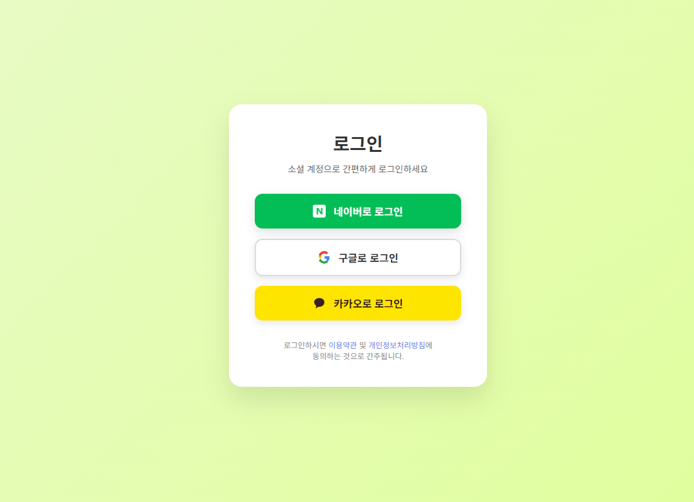

## OAuth2 소셜 로그인 구현 연습
- `개발자유미`님의 **OAuth2 클라이언트 세션**을 보고 소셜 로그인 구현을 따라해보고 있습니다.

### 실행 시 보이는 화면
- v0 툴을 활용하여 간단하게 프론트엔드를 구성하였습니다.
- `localhost:8080/login`

- 이후에 외부 인증 서버를 통해서 로그인이 완료되면, Mysql에 해당 회원 정보가 가입/업데이트 됩니다.
- `localhost:8080`

- 해당 페이지에서 프로필 관리를 누르면 마이페이지로 이동되고, 해당 페이지는 로그인된 사람만(`ROLE_USER`) 접근 가능하도록 하였습니다.
- `localhost:8080/my`

---

### 발생했던 오류
google과 naver처럼 변수를 동일하게 설정했더니, kakao에서는 `invalidcredentials` 오류가 발생하였다.

1. logging의 level을 DEBUG까지 낮추어서 확인해보니, 401: [nobody]가 발생했음을 알 수 있었다.
- chatGPT에게 물어본 결과, Spring이 Kakao 토큰 요청 시에, client-id와 client-secret을 포함하지 않기 때문에 발생한 현상이라고 한다.
- 그래서 properties 파일에 `client-authentication-method`를 post로 명시하였다.

2. method를 post로 넣었더니 `IllegalArgumentException`이 발생하였다.
- Spring은 post가 아니라, client_secret_post를 허용해서 생긴 일이었다.
- 카카오는 client_id와 client_secret을 본문 파라미터로 전송하기 때문에 `client_secret_post` 방식으로 넣는 것 같다. 
  -  인증 토큰 발급 요청 메소드가 post이다.
  - Spring security 5.6 이후로 post가 client_secret_post로 변경되었다고 한다.
  
- 이 부분에 대하여 질문을 드렸는데, 좀 더 명확히 답변해주셔서 답변을 정리해보았다.
  - `client-authentication-method`의 경우 백엔드에서 `client-id`와 `client-secret`으로 소셜 로그인 제공자에게 토큰을 요청할 때,
  - 어떤 방식으로 요청할지는, 소셜 로그인 제공자의 API 스펙에 따라 설정을 해야한다.
  - 여기서 카카오의 경우는 기본값이 아닌 POST 방식을 요구하여 해당 문제가 발생하는 것으로 보인다.

- 참고로, client-authentication-method의 경우, `none : 인증없이`, `client_secret_basic : 기본값 -> 헤더 방식 요청`, `client_secret_post: http body에 넣어서 요청` 이라고 한다. 